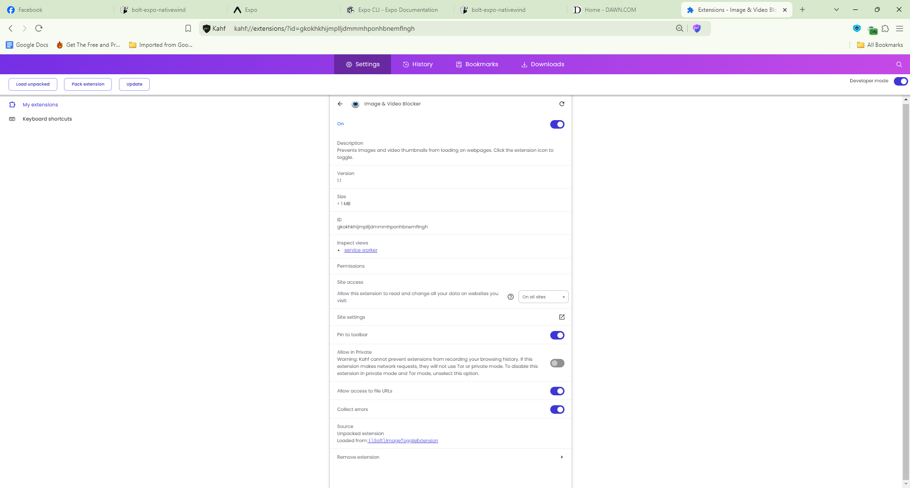
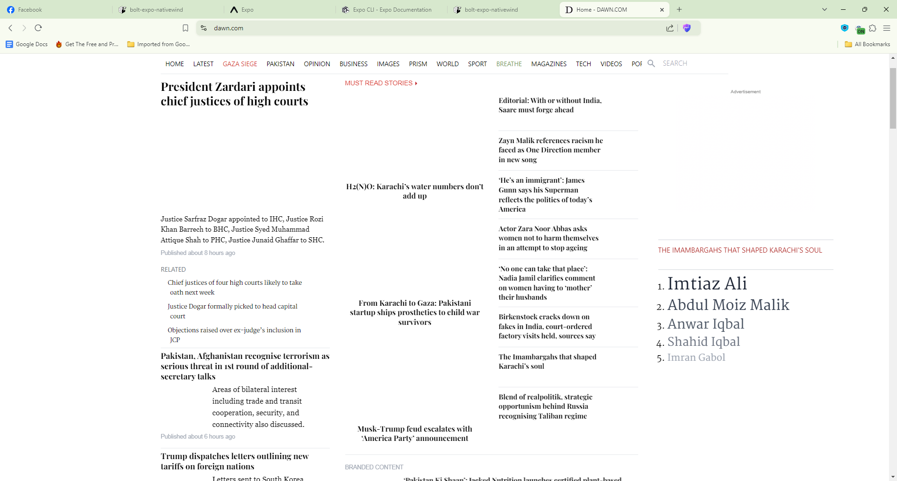
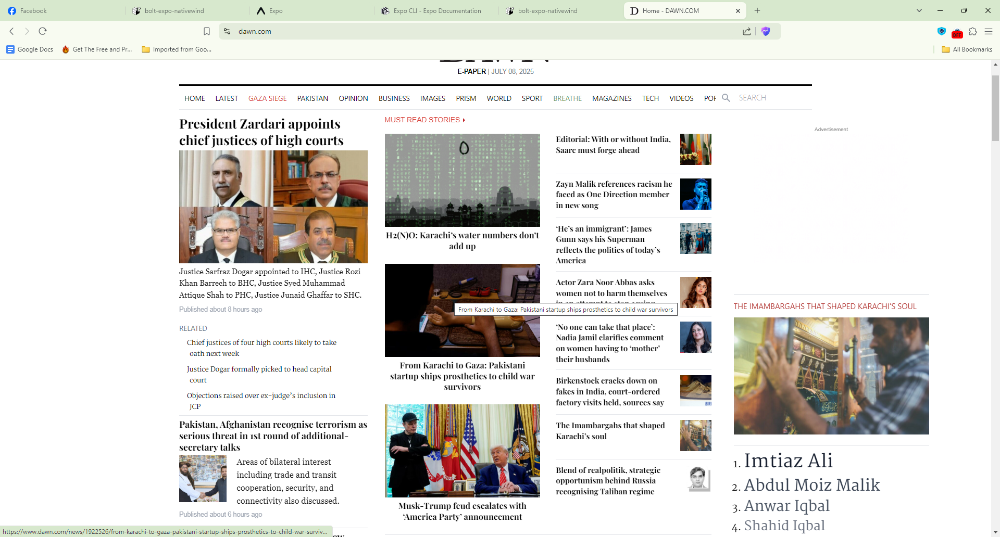

# 🧱 Image Blocker Chrome Extension

**Image Blocker** is a lightweight Chrome extension that blocks all images — including ``, `<picture>`, and CSS background images — on webpages when enabled.

## 🚀 Features

- ✅ Toggle image blocking on/off
- ✅ Persistent settings across sessions
- ✅ Blocks ``, `<picture>`, lazy-loaded images, and background images
- ✅ Lightweight and fast
- ✅ Built with Manifest V3

## 📸 Screenshots

### Popup UI


### Before Image Blocking


### After Image Blocking



## 📦 Installation

1. Clone the repo:
   ```bash
   git clone https://github.com/curiousimran/image-blocker.git
   ```
2. Open Chrome and go to `chrome://extensions/`
3. Enable **Developer mode** (top-right)
4. Click **Load unpacked**
5. Select the `image-blocker` folder

## 📁 File Structure

```
image-blocker/
├── background.js        # Background service worker
├── content.js           # Content script for blocking images
├── popup.html           # UI for toggling blocking
├── popup.js             # Logic for popup
├── manifest.json        # Chrome extension config
├── icon.png             # Toolbar icon
├── README.md            # Project overview and usage
├── LICENSE              # MIT License
```

## 🧪 Testing

Test the extension on sites like:

- [Pinterest](https://www.pinterest.com/)
- [Instagram](https://www.instagram.com/)
- E-commerce sites

## 🛠️ Built With

- Vanilla JavaScript
- Chrome Manifest V3

## 🪪 License

This project is licensed under the MIT License - see the [LICENSE](LICENSE) file for details.

